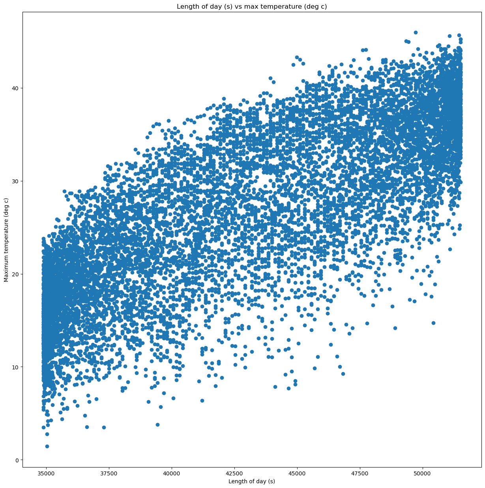

## Week 10 Assignment
Practice with what we have already learned

## Grade
3/3 - Nice work. Glad to hear the extra practice was helpful. 

## Assignment Answers and Graphs
# Tuesday Assignment

# Thursday Assignment
Question 2.2: Contains info about the year, day of year, length of day, precipitation, suns radiation, temp max and min, etc. Dates range from 1992-09-25 to 2022-09-25. This data is daily data.

## Notes
I feel like I understand functions and pandas a bit better after these exercises. It really helped to combine all the things we have learned into exercises for more practice. I still feel like loops are a little rough. For both loops and functions, I struggle to figure out how to start. But once I figure out how to start it, it becomes much easier. 