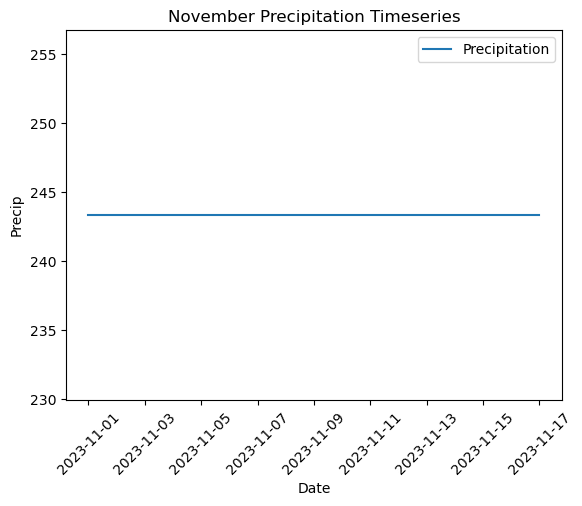

## Assignment 12

# Assignment Answers
1. I chose my forecast numbers by looking at the numbers for the past week along with the GFS weather forecast models. There appears to have been rainfall on Sunday and Monday therefore we can expect the streamflow to increase. 
2. I used to same dataset that we used in class and looked at precipitation accumulation. I couldn't figure out how to get a different dataset. It is all a little confusing. 
3. Plots:
   
4. I felt better about this assignment after talking with you in office hours. But overall this is still a fairly confusing assignment. I still struggled to get things to work properly. 