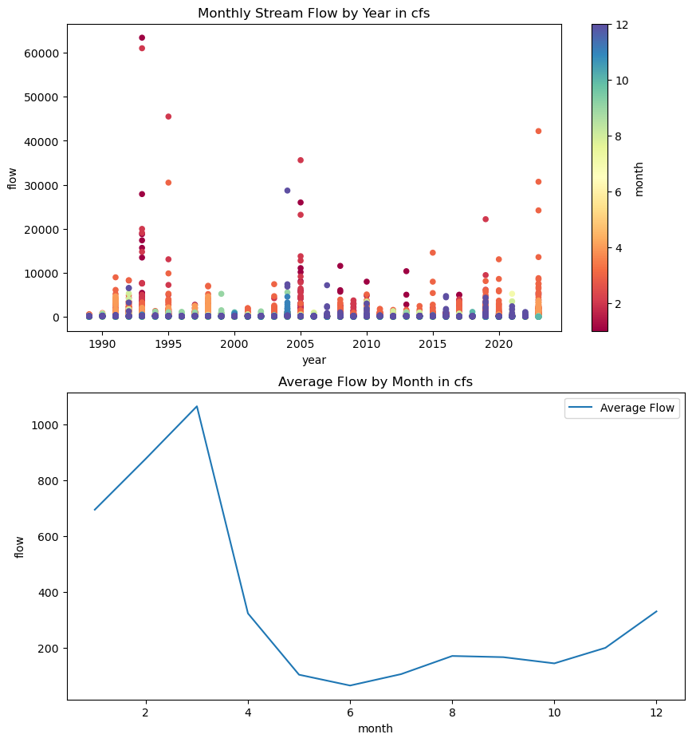
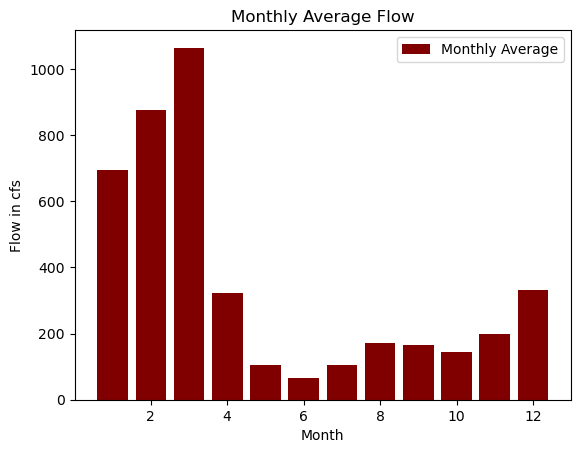
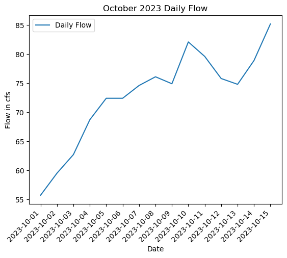
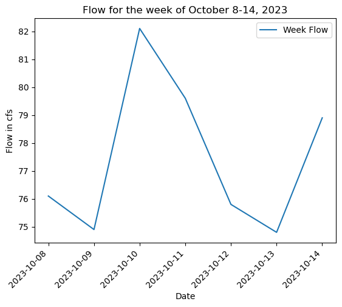

# Week 7 Assignment

Matplotlib assignment

### Grade
3/3: Nice work. Pandas data frames can be very tricky but I'm glad you were able to get some plots out. 
###

## Forecast Summary
For this weeks forecast summary, I looked at the flow for the past two weeks to see what the trend looks like. I then looked at the GFS model to see what the possibility of rainfall was for the next two weeks. There appears to be rainfall possible within the two week forecast so I increased the forecast to account for that.

## Assignment
1. 
   -I thought it was cool to have the ability to see both the scatter plot and the line plot together. I like being able to see the averages, as well as the months with the maximums and minimums. 
2. 
   -This is similar to the second plot on the first image, but I did it in a different way. 
3. 
   -This plot shows the daily flow, for the month of October in 2023, I find this to be the most useful for forecasting.
4. 
   -This plot shows the flow over the last week.
5. 
   -I thought it would be interesting the see the total flow in comparison to the average flow each month

Pandas dataframes have caused me a bit of issues but I am slowly but surely getting a better hand of it!