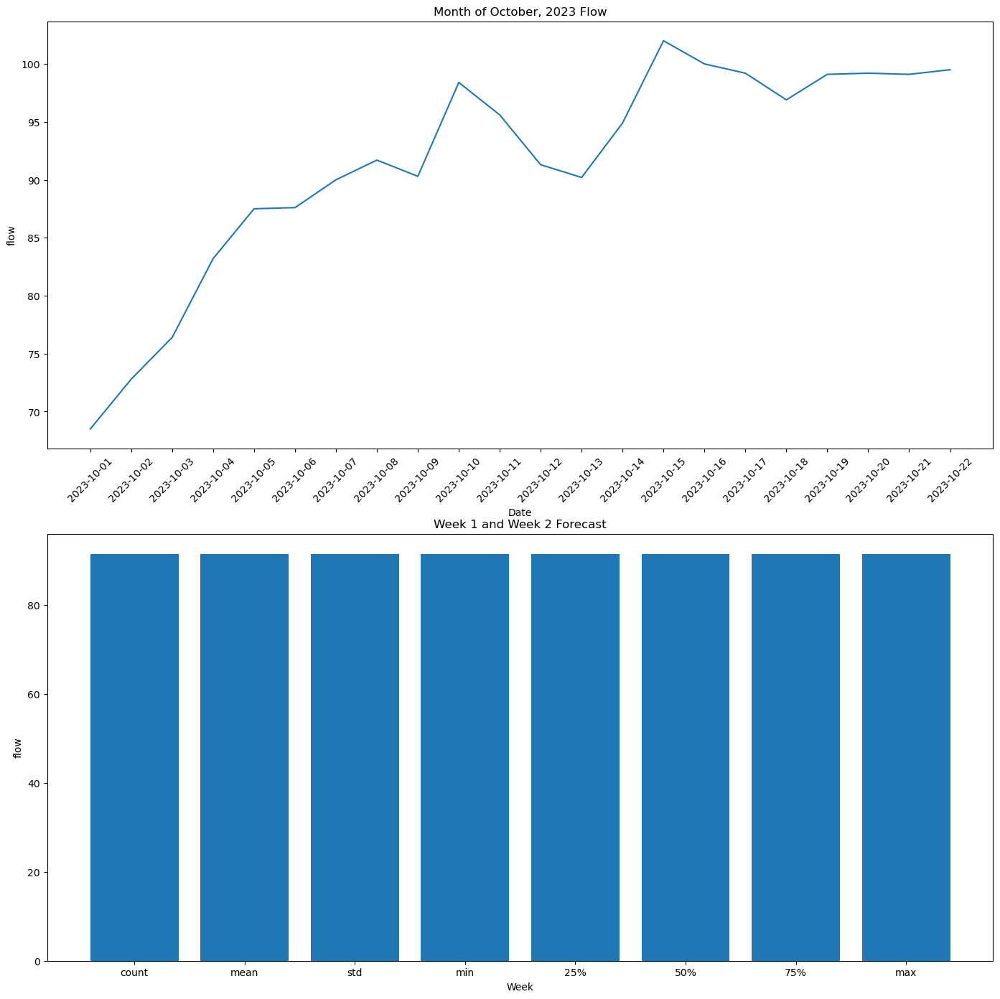

# Week 8 Assignment
Timeseries assignment

### Grade
3/3: Nice work, sorry you couldn't get the plot working. Feel free to come by my office hours for help. Pandas is quite confusing I know. 
###

## Forecast Summary
1 Week Forecast = 91.51818181818182
2 Week Forecast = 88.51818181818182

I calculated these forecasts by taking the average of the month of October flow and using that as the forecast for week 1. For week 2, I subtracted by 3 because according to the GFS model, there seems to be a lack of rainfall, so by subtracting by 3 I am making an estimation of how the flow will change. I have found that similar to meteorological forecasting, using climatology has a tendency to be far less accurate than looking at the last week, current conditions, and modeled forecasts. I have done far better using rainfall models.  

Graphs:

Honestly, this plot did not go as I wanted it to.  For the second graph, I wanted to have a bar plot with one bar being my week 1 forecast and my week 2 forecast. However, I couldn't quite get it to work. I ran into a lot of (as expected with what I struggle with) pandas issues. 

Things are going pretty well, other than frustration with pandas stuff. But, I am slowly but surely getting a hold of it. I am just struggling to figure out how to get this working for this case.