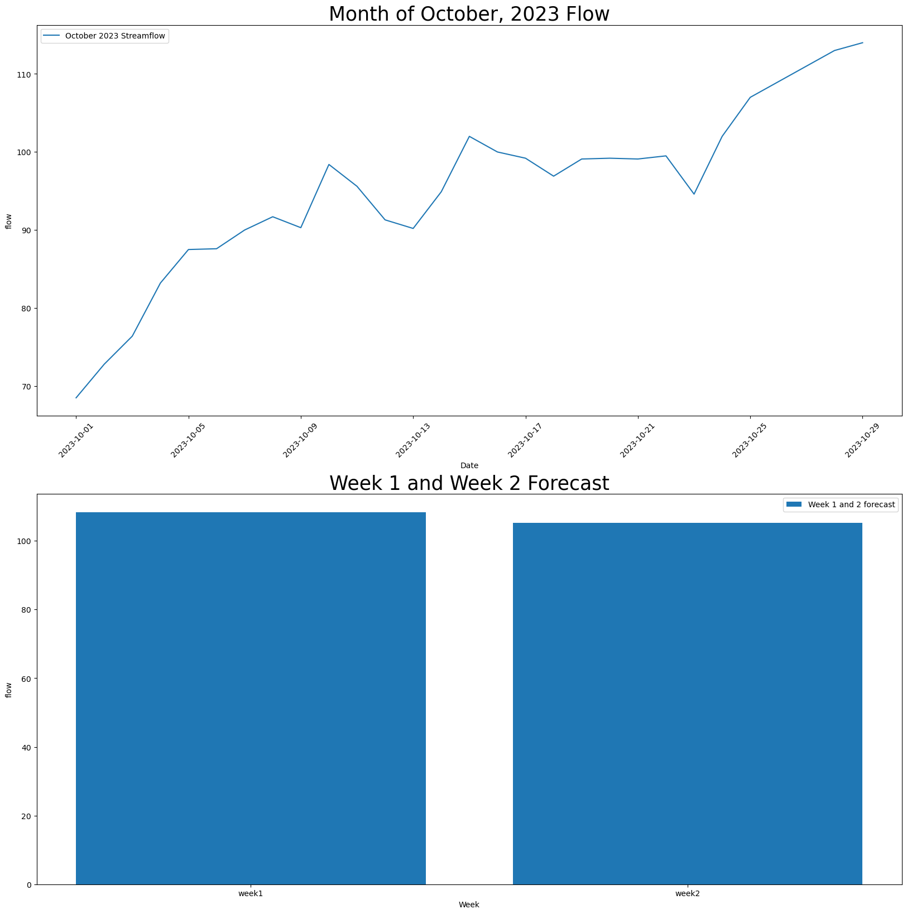

# Week 9 Assignment
Timeseries and Functions

## Forecast Summary 
1 Week Forecast = 108.3103448275862
2 Week Forecast = 105.3103448275862

I calculated this forecast by taking the average of the month of October flow. In order to get a more accurate forecast, I looked more specifically at the last weeks forecast and I have noticed an upward trend in flow over the last week into the 110's. This helped me to decide how much I would add to the flow. There is no rainfall forecasted in the area over the next two weeks so I tried to have my forecast reflect that. 

## Script Improvements
This week, I made my script easier to understand by using comments and more direct naming of different variables. I did my best to make the changes suggested by flake 8, but some of them are a bit difficult to figure out what they mean. I also added in a function and changed the fontsize of the graphs titles so they were easier to read.

## Function
I added a function in to define the month and dataframe I wanted to use for my timeseries. It was used to specify a year of 2023 and any flow that has occured including or after October. I added this function because it made the most sense for what we have discussed in class and it made understanding how I got just october a little easier.

## Graph

I was able to make it work and look pretty! Thanks for your help!

## Remaining Questions
I think my script makes far more sense to me now and I have been able to gain a better understanding after our office hours. I am really looking forward to getting the extra practice time in class this week.